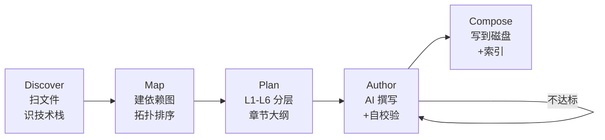

<div align="center">

# rebuildproject

**把任意代码仓库反推成一本"项目搭建之书"——读完跟着抄,你既得到副本,又掌握了它为什么这么造。**

[](./package.json)
[](./package.json)
[](./LICENSE)
[](#-三种-ai-provider)

</div>

---

## 核心承诺

> 一本完整的书,从空目录到能跑起来的项目副本——**首尾相接,每章可还原,知识点必讲,做中学**。

- **整本书完整可还原**——每一章给出涉及文件的完整内容,你只需要按顺序复制粘贴,中间不留洞。
- **既是步骤也是知识点**——每一章新出现的库 / 工具 / 概念都当成知识点讲清楚:一句话定义、设计动机、官方推荐用法、本项目里的具体用法。
- **首尾相接的子任务链**——总任务被拆成 N 个子任务,第 N 章末尾的产物就是第 N+1 章的前置。每章都标注「子任务定位」与「串通下一站」。
- **做中学**——每章末尾给立即可执行的验证命令,跑通了再翻下一页。

它和 [zread\_cli](https://github.com/ZreadAI/zread_cli) 的根本区别——zread 输出"项目是什么"的 Wiki,本工具输出"项目是如何被一步步建造起来的"实战课。

---

## 目录

- [快速开始](#快速开始)
- [手册章节脉络](#手册章节脉络)
- [它是怎么工作的](#它是怎么工作的)
- [安装](#安装)
- [子命令一览](#子命令一览)
- [三种-AI-Provider](#-三种-ai-provider)
- [输出结构](#输出结构)
- [配置](#配置)
- [代码组织](#代码组织)
- [设计取舍](#设计取舍)
- [开发](#开发)
- [许可证](#许可证)

---

## 快速开始

```bash
# 1. 体检环境(可选,但推荐)
rebuildproject doctor

# 2. 配置 AI provider(首次使用)
rebuildproject config

# 3. 在任意目标项目里
cd ~/work/some-repo
rebuildproject generate

# 4. 浏览器看
rebuildproject preview
# 打开 http://localhost:4567

# 5. 自检:把手册里的代码块复原出来,逐文件 diff 原项目
rebuildproject verify
```

---

## 手册章节脉络

按"工程师怎么思考"组织,不是按"目录顺序":

| 章 | 标题 | 在教什么 | 每章强制深度小节 |
|---|---|---|---|
| 00 | **整体浏览与总任务** | 项目要解决什么真问题?边界在哪?**总任务怎么拆成子任务?** | 项目意图 / 总任务 / 子任务拆解 / 子任务依赖 / 关键技术清单 / 学习路线 |
| 01 | **子任务 01 · 选型与脚手架** | 为什么是这个语言/框架/构建工具?同类替代为什么不选?从零怎么起 | 子任务定位 / 设计思路 / 知识点介绍 / 重点 / 难点 / 实现步骤 / 做中学验证 / 精髓 / 串通下一站 |
| 02 | **子任务 02 · 依赖与配置** | 把工程跑起来的全部基础——依赖背后的取舍、配置的契约 | 同上九段式 |
| 03 | **子任务 03 · 核心抽象** | 入口、跨模块契约、关键类型与接口——这是看懂全书的"语言" | 同上九段式 |
| 04-NN | **子任务 04-NN · 模块深挖** | 每个模块独立一章:子问题、可选解、最终选了哪种、踩过什么坑 | 同上九段式 |
| 05 | **子任务 05 · 韧性与测试** | 边界、错误路径、防退化——工程"硬度"是怎么注入进去的 | 同上九段式 |
| 06 | **子任务 06 · 出厂与运维** | 从 main 分支到生产,构建/部署/CI/可观测的完整链路 | 同上九段式 |

**每章九段式**(强制小节,缺一不可,缺则自动修订):

```
子任务定位 → 目标 → 前置 → 设计思路 → 知识点介绍 → 重点 → 难点 → 实现步骤(完整代码)→ 做中学验证 → 精髓 → 串通下一站
```

---

## 它是怎么工作的



整条 pipeline 只有 **Author 一步调 AI**——前 3 步纯本地分析给 AI "结构化输入",第 5 步把产物写盘。

**Author 步是核心**:每章生成后 validator 检查 9 个深度小节(子任务定位 / 设计思路 / 知识点 / 重点 / 难点 / 实现步骤 / 做中学验证 / 精髓 / 串通下一站)+ 文件代码块完整性 + 占位符检测。任一不达标,把缺陷列表喂回模型让它针对性修订,最多 2 轮。**这就是"自主迭代"——AI 不是一锤子买卖,而是写 → 自我审查 → 修订循环。**

---

## 安装

### 从源码

```bash
git clone https://github.com/LiXiaoYaoCareFree/rebuildproject.git
cd rebuildproject
npm install
npm run build

# 全局链接,从此 `rebuildproject` 在任意目录都能跑
npm link
```

### 从 npm(发布后)

```bash
npm i -g rebuildproject
```

> 需要 **Node.js ≥ 20**。

---

## 子命令一览

| 命令 | 说明 |
| --- | --- |
| `rebuildproject generate` | 主流程:跑完整 pipeline,落盘手册到 `./rebuild-guide/` |
| `rebuildproject config` | 交互式选 provider / 填 API key / 选输出语言 |
| `rebuildproject preview` | 起本地静态服务(默认 4567)在浏览器里看手册 |
| `rebuildproject verify` | 提取手册里的代码块写到临时目录,与原项目逐文件 diff |
| `rebuildproject doctor` | 体检:claude CLI / API key / Node 版本 / 写权限 |

`generate` 常用 flag:

```bash
rebuildproject generate -C /path/to/repo  # 指定目录
rebuildproject generate -c 5              # 章节并发数
rebuildproject generate -r 2              # 每章最多 2 轮自动修订
rebuildproject generate -p claude-code    # 临时切 provider
```

---

##  三种 AI Provider

| Provider | 适用场景 | 凭据 |
| --- | --- | --- |
| **claude-code**(推荐) | 已装 Claude Code CLI,希望直接复用其登录态 | 不需要 API key |
| **claude** | 想直接用 Anthropic API | `ANTHROPIC_API_KEY` 或 `config` 里填 |
| **openai-compatible** | 用 OpenAI / DeepSeek / Kimi / 智谱 / OpenRouter / 自建端点 | `OPENAI_API_KEY` + 改 `baseURL` |

切换 provider:

```bash
rebuildproject config                   # 交互式重选
# 或单次命令覆盖:
rebuildproject generate -p openai-compatible
```

配置文件:`~/.rebuildproject/config.yaml`

---

## 输出结构

```
rebuild-guide/
├── README.md                       # 书的扉页:四条整书承诺 + 目录 + 怎么读
├── 00-intent.md                    # 00 · 整体浏览与总任务
├── 01-stack-and-scaffold.md        # 子任务 01 · 选型与脚手架
├── 02-deps-and-config.md           # 子任务 02 · 依赖与配置
├── 03-core-abstractions.md         # 子任务 03 · 核心抽象
├── 04-modules/                     # 子任务 04-NN · 模块深挖,一模块一章
├── 05-resilience-and-tests.md      # 子任务 05 · 韧性与测试
└── 06-ship-and-ops.md              # 子任务 06 · 出厂与运维
```

每章 markdown 都用 `lang:相对路径` 形式标注完整文件代码块,例如:

````md
```ts:src/cli.ts
import { Command } from "commander";
// ...完整内容
```
````

`rebuildproject verify` 会扫这些代码块,把它们写回磁盘,与原项目逐字节比对——**这是"完整可还原"承诺的可执行保证**。

---

## 配置

### 配置文件路径

```
~/.rebuildproject/config.yaml
```

### 配置项

<details>
<summary>展开看完整字段</summary>

```yaml
# AI 后端,可选:claude-code / claude / openai-compatible
provider: claude-code

# 输出语言:zh / en
language: zh

# 章节并发数(默认 3)
concurrency: 3

# 每章最多自动修订轮数(默认 1)
maxRepairs: 1

# Provider 各自的子项(只有匹配 provider 才会被使用)
claudeCode:
  binary: claude       # claude CLI 可执行文件路径
  model: default       # 模型名,default 走 CLI 默认值

claude:
  apiKey: sk-...       # 也可走 ANTHROPIC_API_KEY 环境变量
  model: claude-sonnet-4-6
  baseURL: https://api.anthropic.com

openai:
  apiKey: sk-...       # 也可走 OPENAI_API_KEY 环境变量
  model: gpt-4o-mini
  baseURL: https://api.openai.com/v1   # 改这里支持 DeepSeek/Kimi/智谱/自建端点
```

</details>

### API Key 来源优先级

```
配置文件 → 环境变量 → 报错
```

不想把 key 写到磁盘的同学:`config` 时跳过密码输入,改在 shell 里 `export ANTHROPIC_API_KEY=...`。

---

## 代码组织

```
src/
├── cli.ts                       入口:注册命令并 dispatch
├── commands/                    五个子命令,每个独立一文件
│   ├── generate.ts              ── 唯一职责:解析 flag → runPipeline
│   ├── config.ts
│   ├── preview.ts
│   ├── verify.ts
│   └── doctor.ts
├── pipeline/
│   ├── index.ts                 串联 PIPELINE = [discover, map, plan, author, compose]
│   ├── types.ts                 Step<I,O> 接口 + 各步 typed I/O
│   └── steps/                   每步一文件,看名字就知道做什么
│       ├── discover.ts
│       ├── map.ts
│       ├── plan.ts
│       ├── author.ts            ── 含 critique/repair 循环
│       └── compose.ts
├── core/                        无 AI 的纯本地分析
│   ├── scanner.ts
│   ├── stack-detector.ts
│   ├── dep-graph.ts
│   ├── layerer.ts
│   ├── planner.ts               ── 把章节叙事成"子任务 NN · ..."
│   ├── chapter-builder.ts       唯一与 prompt 模板交互的地方
│   ├── validators.ts            ── 九段式 + 文件代码块 + 占位符校验
│   └── writer.ts                ── 生成的 README 写成"书的扉页"
├── providers/                   AI 后端,统一 Provider 接口
│   ├── types.ts
│   ├── claude-code.ts           ── 用本地 `claude -p` 子进程
│   ├── claude.ts                ── @anthropic-ai/sdk
│   ├── openai.ts                ── OpenAI 兼容
│   └── index.ts                 工厂
├── prompts/index.ts             所有 prompt 模板集中在此(总任务/子任务/知识点/做中学的灵魂全在这)
├── config/store.ts              ~/.rebuildproject/config.yaml
└── utils/
    ├── exec.ts                  subprocess 封装
    ├── concurrency.ts           p-limit 风格的并发控制
    └── logger.ts
```

读源码的入口顺序:`src/cli.ts` → `src/commands/generate.ts` → `src/pipeline/index.ts` → `src/pipeline/steps/*.ts` → `src/prompts/index.ts`(灵魂)。

---

## 设计取舍

- **依赖图浅解析**:跨语言只做正则级 import 抽取,复杂仓库可能漏边——L4 兜底按目录聚合。
- **完整代码块**:Author 强制 AI 给出每个文件的完整内容;validator 检测占位符;这样 `verify` 才能 diff 原项目。
- **本地优先**:所有 IO 仅在本地,不上传任何代码。
- **claude-code 模式**:跟 claude 子进程通信用 stdin/stdout,禁用 `Edit/Write/NotebookEdit` 工具——只让它产生文本,不碰你的文件。
- **不怕长**:每章 maxTokens 16k,允许章节写到几千字——但每段都必须紧扣"读者此刻在做什么、为什么这么做、做完会得到什么"。**完整性永远优先于篇幅控制。**

---

## 开发

```bash
# 装依赖
npm install

# 类型检查(noUncheckedIndexedAccess 严格)
npm run typecheck

# 构建(tsup,产物 dist/cli.js)
npm run build

# 监听式构建
npm run dev

# 通过 bin 跳板跑(无需 npm link)
node bin/rebuildproject.js --help
```

### 仓库结构约定

- `src/` 是唯一源码目录;`dist/` 是 tsup 产物,**不提交**。
- `bin/rebuildproject.js` 是 5 行的 shebang 跳板:`import("../dist/cli.js")`。
- 所有内部 import 都写 `.js` 扩展名(ESM 强制)。

### 贡献

欢迎提 Issue / PR:
- 新 provider(Gemini / Mistral / 自建模型):实现 `src/providers/types.ts` 里的 `Provider` 接口,加进 `src/providers/index.ts` 的工厂即可。
- 新章节类型 / 新分层规则:改 `src/core/{layerer,planner}.ts` + 对应 prompt + validator。
- 改进 prompt:**核心阵地在 `src/prompts/index.ts`**——欢迎提交"在某类项目上产出更扎实"的 prompt 调整。

---

## 许可证

[MIT](./LICENSE)
